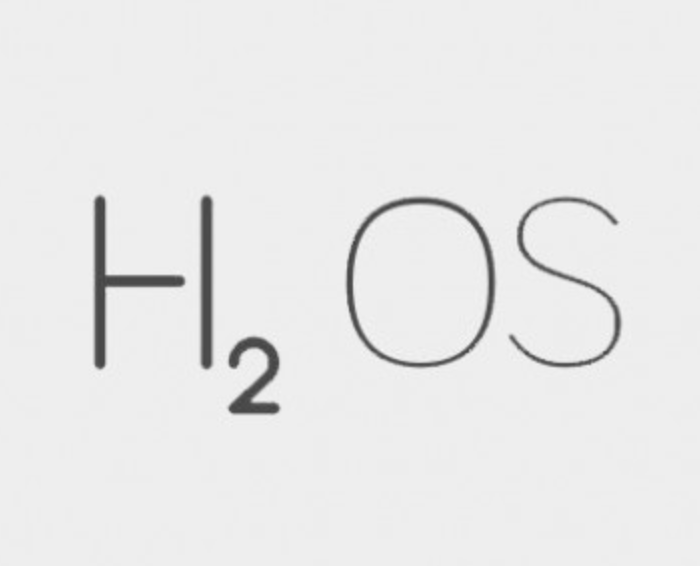
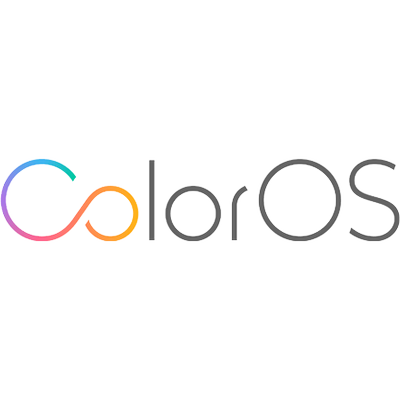
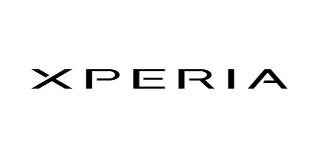
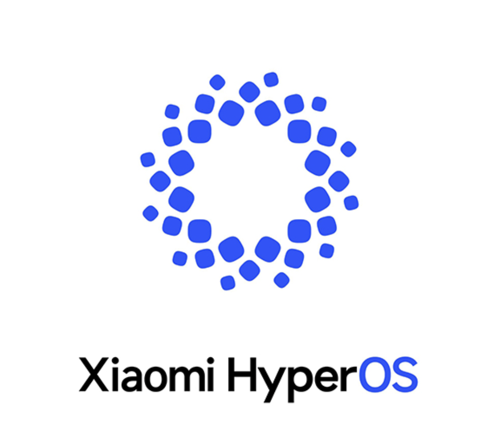
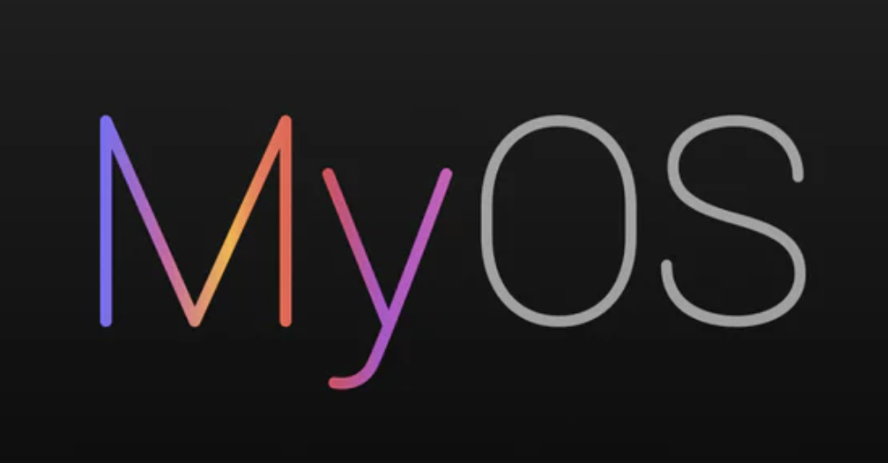

# AndroidROM
hi

| Icon                           | OEM Name     | ROM Name                  | Development Status | Latest Version | Website                                      |
| ------------------------------ | ------------ | ------------------------- | ------------------ | -------------- | -------------------------------------------- |
|        | Asus ROG     | **ROGUI**                 | Active             | 14             | [Website](https://www.asus.com/in/content/ui/)|
|        | BlackShark   | **JoyUI**                 | Discontinued       | 13             | [Website]()                                  |
|      | Blackview    | **DokeOS**                | Active             | 4              | [Website](https://promo.blackview.hk/os3/)   |
|    | Gionee       | **AmigoOS**               | Discontinued       | 5              | [Website]()                                  |
|    | Google       | **Android**               | Active             | 15             | [Website](https://www.android.com/intl/en_in/android-14/)|
|    | Honor        | **MagicOS**               | Active             | 8              | [Website](https://www.honor.com/in/magic-os/)|
|          | Huawei       | **EMUI**                  | Active             | 14             | [Website](https://consumer.huawei.com/en/emui-13/)|
|  | HTC          | **Htc Sense**             | Discontinued       | 11             | [Website](https://www.android.com/intl/en_in/android-14/)|
|            | Infinix      | **XOS**                   | Active             | 13             | [Website](https://www.infinixmobiles.in/xos/)|
|            | Lenovo       | **ZUI**                   | Active             | 16             | [Website](https://m.zui.com/#/)              |
| | Meizu       | **FlymeAIOS**             | Active             | 11             | [Website](https://www.flyme.com/aios)        |
|    | Motorola     | **HelloUI**               | Active             | 1              | [Website](https://www.motorola.in/my-ux/p)   |
|          | Motorola     | **MyUI**                  | Discontinued       | 13             | [Website](https://www.motorola.in/my-ux/p)   |
|        | Nio          | **SkyUI**                 | Active             | 1.5            | [Website](https://phone.nio.com/)            |
| | Nokia     | **PureUI (Android One)**  | Discontinued       | 12             | [Website](https://www.android.com/one/)      |
| | Nothing     | **NothingOS**             | Active             | 3              | [Website]()                                  |
|    | Nubia        | **NubiaUI**               | Discontinued       | 8              | [Website]()                                  |
|  | OnePlus      | **OxygenOS**              | Active             | 15             | [Website](https://www.oneplus.in/oxygenos14) |
| | OnePlus   | **HydrogenOS**            | Discontinued       | 11             | [Website](https://www.oneplus.com/cn/hydrogenos)|
|    | Oppo         | **ColorOS**               | Active             | 15             | [Website](https://www.oppo.com/en/coloros14/)|
|  | Realme       | **RealmeUI**              | Active             | 5              | [Website](https://www.realme.com/in/realme-ui-5)|
| | Redmagic  | **RedmagicOS**            | Active             | 9              | [Website]()                                  |
|        | Samsung      | **OneUI**                 | Active             | 7              | [Website](https://www.samsung.com/in/one-ui/)|
| | Samsung | **Samsung Experience**  | Discontinued       | 10             | [Website](https://www.samsung.com/in/one-ui/)|
|  | Sony         | **XperiaUI**              | Active             | 14             | [Website](https://www.android.com/intl/en_in/android-14/)|
|          | Tecno        | **HiOS**                  | Active             | 13             | [Website](https://www.tecno-mobile.com/hios-detail/)|
| | Vivo      | **FuntouchOS**            | Active             | 14             | [Website](https://www.vivo.com/in/funtouch)  |
|  | Vivo         | **OriginOS**              | Active             | 4              | [Website](https://www.vivo.com.cn/originos)  |
|    | Xiaomi       | **HyperOS**               | Active             | 1              | [Website Global](https://www.mi.com/global/hyperos) [Website China](https://hyperos.mi.com/)|
|          | Xiaomi       | **MIUI**                  | Discontinued       | 14             | [Website Global](https://www.mi.com/global/miui) [Website China](https://home.miui.com/14)|
|          | ZTE          | **MyOS**                  | Active             | 14             | [Website](https://www.ztedevices.com/cn/myos/)|
